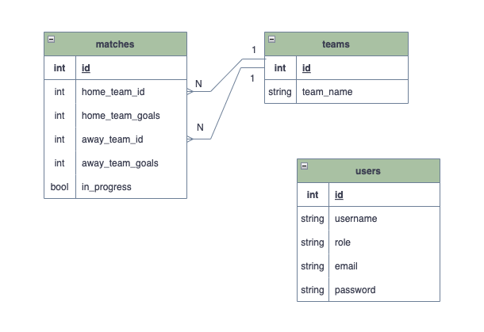

# futebol-clube

## Contexto
- Este projeto visa desenvolver uma API (utilizando o método TDD) e também integrar - através do docker-compose - as aplicações para que elas funcionem consumindo um banco de dados.
- você deve construir um back-end dockerizado utilizando modelagem de dados através do Sequelize. Seu desenvolvimento deve respeitar regras de negócio providas no projeto e sua API deve ser capaz de ser consumida por um front-end já provido nesse projeto.
- O back-end deverá implementar regras de negócio para popular adequadamente a tabela disponível no front-end que será exibida para a pessoa usuária do sistema.

## Estrutura do projeto

### Banco de dados:
- Será um container docker MySQL já configurado no docker-compose através de um serviço definido como db.

###  Back-end:
- Deve rodar na porta 3001, pois o front-end faz requisições para ele nessa porta por padrão.
- a aplicação deve ser inicializada a partir do arquivo app/backend/src/server.ts e o express executado e a aplicação deve ouvir a porta que vem das variáveis de ambiente;ie o ambiente virtual para o projeto.
- O express deve ser executado e a aplicação deve ouvir a porta que vem das variáveis de ambiente;ie o ambiente virtual para o projeto.
- o Dockerfile que deve ser construído.

###  Front-end:
- O front já está desenvolvido exceto o Dockerfile que deve ser configurado.
- Todos os testes a partir do requisito de login usam o puppeteer para simular uma pessoa acessando o site http://localhost:3000/.

### Docker
- O docker-compose tem a responsabilidade de unir todos os serviços conteinerizados (backend, frontend e db) e subir o projeto completo com o comando npm run compose:up.
 
## Sequelize
Utilizar o Diagrama de Entidade-Relacionamento (DER) para construir a modelagem do banco de dados. 

